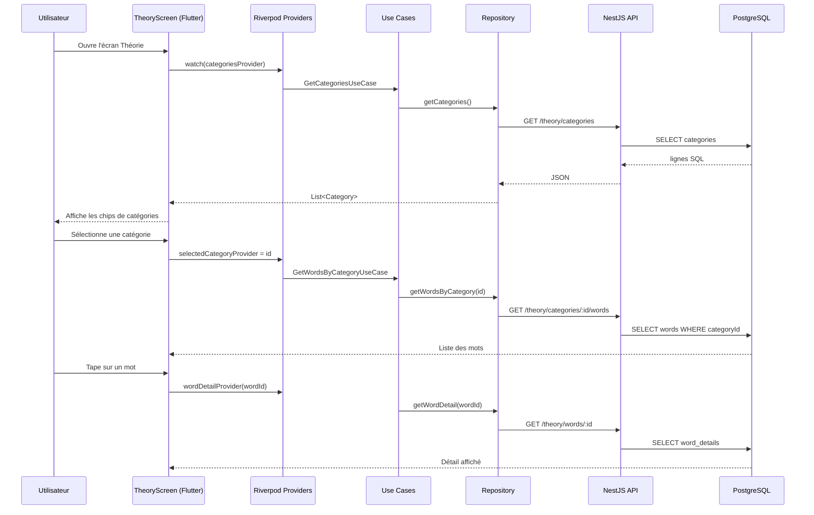
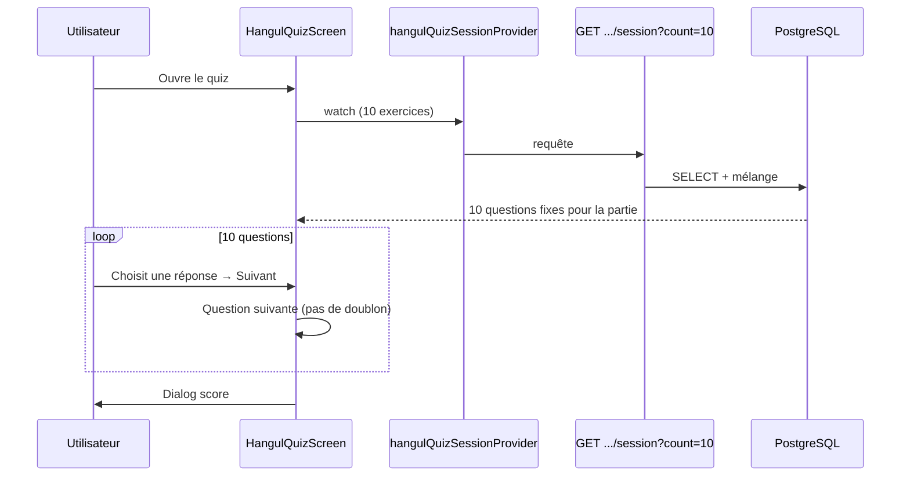

# Explication des features K-Boost (Theory + Cours)

Document préparé pour la soutenance et pour l’équipe : comment les fichiers s’articulent, comment les données circulent, et pourquoi l’architecture a été choisie ainsi.

---

## 1. Vue d’ensemble

La feature **Theory** permet à l’utilisateur de :

1. Voir les **catégories** de vocabulaire (Pronoms, Verbes, etc.).
2. Filtrer les **mots** par catégorie (ou voir tous les mots).
3. Ouvrir le **détail** d’un mot (type grammatical, exemple de phrase).

L’application est découpée en **deux parties** :

| Partie | Technologie | Rôle |
|--------|-------------|------|
| **Mobile** | Flutter + Riverpod | Interface utilisateur |
| **Backend** | NestJS + Prisma + PostgreSQL | API REST + base de données |

Les données ne sont **plus lues depuis des JSON** au moment de l’exécution : l’API interroge **PostgreSQL**. Les fichiers JSON servent uniquement au **seed** (remplissage initial de la base).

---

## 2. Parcours complet des données



En une phrase : **l’UI ne parle jamais directement à la base** ; elle passe par des couches bien séparées (Use Case → Repository → HTTP → Service → Prisma → PostgreSQL).

---

## 3. Backend (dossier `backend/`)

### 3.1 Structure des fichiers importants

```
backend/
├── prisma/
│   ├── schema.prisma          # Modèle de données (tables)
│   ├── seed.ts                # Import JSON → PostgreSQL (dev)
│   └── migrations/            # Historique des changements SQL
├── prisma.config.ts           # URL BDD pour migrate / seed (CLI)
├── src/
│   ├── main.ts                # Démarre le serveur (port 3000)
│   ├── app.module.ts          # Module racine NestJS
│   ├── prisma/
│   │   ├── prisma.module.ts   # Module global Prisma
│   │   └── prisma.service.ts  # Connexion à PostgreSQL
│   └── theory/
│       ├── theory.module.ts   # Regroupe controller + service
│       ├── theory.controller.ts  # Routes HTTP
│       ├── theory.service.ts     # Logique métier + requêtes BDD
│       └── data/*.json        # Données sources pour le seed uniquement
```

### 3.2 `prisma/schema.prisma` — le modèle de données

Trois tables liées :

| Modèle Prisma | Table SQL | Contenu |
|---------------|-----------|---------|
| `Category` | `categories` | id, name (ex. « Verbes ») |
| `Word` | `words` | mot coréen, romanisation, traduction, `categoryId` |
| `WordDetail` | `word_details` | type grammatical, phrase d’exemple (1 détail par mot) |

Relations :

- Une **catégorie** a plusieurs **mots**.
- Un **mot** a au plus un **détail** (`WordDetail` lié par `wordId`).

L’index sur `categoryId` accélère le filtrage des mots par catégorie.

### 3.3 `prisma/seed.ts` — remplir la base une fois

- Lit `categories.json`, `words.json`, `word_details.json`.
- Fait des `upsert` (créer ou mettre à jour) dans PostgreSQL.
- Commande : `npm run db:seed` (après `npm run db:migrate`).

**Pourquoi garder les JSON ?** Pratique en développement : on peut réinitialiser la base sans tout retaper à la main. En production, les données vivent dans PostgreSQL.

### 3.4 `PrismaService` — connexion à la base

- Étend `PrismaClient`.
- Se connecte au démarrage du serveur (`onModuleInit`).
- Se déconnecte proprement à l’arrêt (`onModuleDestroy`).
- Injecté partout où on a besoin d’accéder à la BDD.

### 3.5 `TheoryController` — les routes HTTP

| Méthode | Route | Rôle |
|---------|-------|------|
| GET | `/theory/categories` | Liste toutes les catégories |
| GET | `/theory/categories/:id/words` | Mots d’une catégorie |
| GET | `/theory/words/:id` | Détail d’un mot |

Le controller **ne contient pas de logique métier** : il délègue au `TheoryService`. C’est le principe **Controller mince** de NestJS.

### 3.6 `TheoryService` — logique métier

- `getCategories()` : `findMany` sur `category`, tri par id.
- `getWordsByCategory(categoryId)` :
  - Si `categoryId === '0'` → tous les mots (catégorie fictive « Tous les mots »).
  - Sinon vérifie que la catégorie existe, puis filtre par `categoryId`.
- `getWordDetail(wordId)` : cherche dans `wordDetail` ; renvoie 404 si absent.

Gestion d’erreurs explicite : `BadRequestException` (id vide), `NotFoundException` (catégorie ou mot introuvable). L’app mobile peut afficher un message clair.

### 3.7 `TheoryModule` et `AppModule`

- `TheoryModule` importe `PrismaModule`, déclare `TheoryController` et `TheoryService`.
- `AppModule` charge `TheoryModule` au démarrage → les routes `/theory/*` sont disponibles.

---

## 4. Application Flutter (dossier `lib/features/theory/`)

Architecture **Clean Architecture** en 3 couches :

```
presentation/     → Écrans + Riverpod (UI)
domain/           → Entités + Use Cases + contrats Repository
data/             → Models JSON + DataSource HTTP + Repository impl
```

### 4.1 Couche `domain/` — le cœur métier (sans Flutter, sans HTTP)

| Fichier | Rôle |
|---------|------|
| `entities/category.dart` | Objet métier « catégorie » (id, name) |
| `entities/word.dart` | Objet métier « mot » |
| `entities/word_detail.dart` | Objet métier « détail » |
| `repositories/theory_repository.dart` | **Interface** : contrat que la couche data doit respecter |
| `usecases/get_categories_usecase.dart` | Action « récupérer les catégories » |
| `usecases/get_words_by_category_usecase.dart` | Action « mots par catégorie » |
| `usecases/get_word_detail_usecase.dart` | Action « détail d’un mot » |

Les **Use Cases** sont petits : ils appellent le repository. Un Use Case = **une action utilisateur** claire pour la soutenance.

### 4.2 Couche `data/` — accès aux données distantes

| Fichier | Rôle |
|---------|------|
| `datasources/theory_remote_datasource.dart` | Interface des appels HTTP |
| `datasources/theory_remote_datasource_impl.dart` | Implémentation avec `package:http` |
| `models/*_model.dart` | Conversion JSON API → objets Dart (`fromJson`) |
| `repositories/theory_repository_impl.dart` | Implémente `TheoryRepository` en déléguant au DataSource |

**Exemple de flux JSON :**

```json
// Réponse GET /theory/categories
[{ "id": "1", "name": "Pronoms" }]
```

→ `CategoryModel.fromJson()` → `Category` (entité domain).

### 4.3 Couche `presentation/` — interface utilisateur

| Fichier | Rôle |
|---------|------|
| `screens/word_detail_screen.dart` | Détail d’un mot |
| `viewmodels/categories_viewmodel.dart` | **Providers Riverpod** (état + injection) |

#### Providers Riverpod (fichier central pour l’état)

| Provider | Type | Rôle |
|----------|------|------|
| `theoryRemoteDataSourceProvider` | Provider | URL API selon plateforme (Android → `10.0.2.2`) |
| `theoryRepositoryProvider` | Provider | Instance du repository |
| `getCategoriesUseCaseProvider` | Provider | Use case catégories |
| `categoriesProvider` | FutureProvider | Charge et met en cache les catégories |
| `selectedCategoryProvider` | StateProvider | Catégorie sélectionnée (défaut `'0'`) |
| `selectedWordsProvider` | FutureProvider | Mots de la catégorie active (se recharge si sélection change) |
| `wordDetailProvider` | FutureProvider.family | Détail par `wordId` |

**`_resolveBaseUrl()`** : sur émulateur Android, `localhost` pointe vers le téléphone, pas le PC → on utilise `10.0.2.2` pour joindre le backend sur la machine hôte.

### 4.4 Écran principal `TheoryScreen`

1. `ref.watch(categoriesProvider)` → affiche les `FilterChip`.
2. `ref.watch(selectedWordsProvider)` → liste des mots filtrés.
3. Clic sur un chip → `selectedCategoryProvider` change → Riverpod **recharge automatiquement** les mots.
4. Clic sur un mot → navigation vers `WordDetailScreen` avec `wordId`.

Pas de `setState` manuel pour les données réseau : Riverpod gère loading / error / data via `.when()`.

### 4.5 Point d’entrée `lib/main.dart`

- `ProviderScope` enveloppe l’app (obligatoire pour Riverpod).
- `home: TheoryScreen()` → la feature Theory est l’écran de démarrage actuel.

---

## 5. Les 3 endpoints — récapitulatif pour l’oral

```
GET http://localhost:3000/theory/categories
GET http://localhost:3000/theory/categories/2/words
GET http://localhost:3000/theory/words/15
```

Test rapide en soutenance :

```bash
cd backend && npm run start:dev
curl http://127.0.0.1:3000/theory/categories
```

---

## 6. Pourquoi cette architecture est une bonne approche

### 6.1 Séparation des responsabilités

| Couche | Responsabilité | Changement isolé |
|--------|----------------|------------------|
| Controller (Nest) | HTTP, codes statut | Nouvelle route sans toucher la BDD |
| Service (Nest) | Règles métier, validations | Logique sans toucher Flutter |
| Prisma | Accès SQL typé | Changer de BDD avec migrations |
| Domain (Flutter) | Règles app pures | Tests sans réseau |
| Data (Flutter) | API + JSON | Changer d’API sans toucher l’UI |
| Presentation | Affichage | Refonte UI sans toucher le métier |

**Bénéfice soutenance :** chaque fichier a **un rôle précis** → plus facile à expliquer, maintenir et faire évoluer.

### 6.2 API REST + base PostgreSQL (plutôt que JSON embarqué)

| Approche JSON local | Approche actuelle (API + BDD) |
|---------------------|-------------------------------|
| Données figées dans l’app | Données centralisées, mises à jour sans republier l’app |
| Pas de partage multi-utilisateur | Prêt pour comptes, progression, favoris |
| Pas de filtrage côté serveur | Requêtes SQL efficaces (`WHERE categoryId`) |
| Taille APK qui grossit | L’app ne charge que ce qu’elle affiche |

### 6.3 Clean Architecture côté Flutter

- **Testabilité** : on peut mocker `TheoryRepository` et tester les Use Cases sans serveur.
- **Indépendance** : le domain ne dépend pas de `http` ni de `Material` → logique réutilisable (tests, autre UI).
- **Évolutivité** : demain, cache local ou GraphQL = nouvelle implémentation du repository, même interface.

### 6.4 Riverpod pour l’état

- **Cache automatique** : `categoriesProvider` ne rappelle pas l’API à chaque rebuild inutile.
- **Réactivité** : changer `selectedCategoryProvider` invalide `selectedWordsProvider` → UX fluide.
- **`FutureProvider.family`** : un cache de détail par `wordId`, pas de mélange entre mots.
- **Injection** : DataSource, Repository et Use Cases créés une fois, wiring centralisé dans `categories_viewmodel.dart`.

### 6.5 NestJS + modules

- Structure standard entreprise (modules, injection de dépendances).
- `TheoryModule` peut grossir (auth, admin) sans polluer le reste de l’app.
- Tests unitaires possibles sur `TheoryService` avec un Prisma mocké (déjà amorcé dans `backend/test/`).

### 6.6 Prisma ORM

- **Schéma unique** (`schema.prisma`) = source de vérité pour les tables.
- **Typage TypeScript** : `Category`, `Word`, `WordDetail` générés automatiquement → moins d’erreurs.
- **Migrations versionnées** : historique des changements de structure, reproductible en équipe.

### 6.7 Modèles de données normalisés

- Pas de duplication massive : le détail lourd est dans `word_details`, la liste utilise `words` (léger).
- Relation `Category` → `Word` évite les listes plates difficiles à filtrer.
- Catégorie `id = "0"` (« Tous les mots ») : convention simple côté service, pas besoin d’une vraie ligne en base pour « tout afficher ».

---

## 7. Ce que tu peux dire en 2 minutes à l’oral

> « La feature Theory suit une architecture client-serveur. L’app Flutter utilise une Clean Architecture avec des Use Cases et Riverpod pour l’état. Elle consomme une API NestJS qui expose trois routes REST. Le backend utilise Prisma pour parler à PostgreSQL. Les données initiales viennent de fichiers JSON uniquement au seed ; en runtime tout passe par la base. Cette séparation permet de faire évoluer l’UI, l’API et la base indépendamment, et de préparer des fonctionnalités futures comme la progression utilisateur ou l’administration du vocabulaire. »

---

## 8. Checklist démo soutenance

1. PostgreSQL démarré, `backend/.env` avec `DATABASE_URL`.
2. `cd backend && npm run start:dev`
3. `curl http://127.0.0.1:3000/theory/categories` → JSON visible.
4. `flutter run` → écran Théorie, chips + liste.
5. Changer de catégorie → liste mise à jour.
6. Ouvrir un mot → détail avec exemple.

---

## 9. Fichiers à montrer rapidement au jury

| Ordre | Fichier | Message clé |
|-------|---------|-------------|
| 1 | `backend/prisma/schema.prisma` | Structure des données |
| 2 | `backend/src/theory/theory.controller.ts` | Contrat API |
| 3 | `backend/src/theory/theory.service.ts` | Logique + requêtes |
| 4 | `lib/.../theory_remote_datasource_impl.dart` | Appel HTTP |
| 5 | `lib/.../categories_viewmodel.dart` | État Riverpod |
| 6 | `lib/.../theory_screen.dart` | Expérience utilisateur |

---

# PARTIE 2 — Feature Cours (module Hangul + quiz)

Cette partie documente le travail fait après la feature Theory : le module **Cours** créé en front par un collègue, puis branché sur le **backend** et PostgreSQL en gardant **le même visuel** à l’écran.

---

## 10. Vue d’ensemble Cours / Hangul

### Parcours utilisateur

1. **Apprentissage** → bouton **Cours** → `CoursScreen`
2. Module **Hangul** → popup → **S'entraîner**
3. `HangulQuizAndRecognitionScreen` : 10 questions, score, feedback ✅/❌

### Avant / après branchement backend

| Avant (front seul) | Après (architecture complète) |
|--------------------|-------------------------------|
| ~24 exercices **en dur** dans le fichier Dart | Exercices en **PostgreSQL** (`hangul_exercises`) |
| Tirage aléatoire local, **doublons possibles** | API **session** : 10 questions **distinctes** par partie |
| Impossible de modifier sans republier l’app | Ajout de questions via JSON + `db:seed` (ou admin plus tard) |

---

## 11. Schéma de données (table `hangul_exercises`)

| Champ | Exemple | Rôle |
|-------|---------|------|
| `id` | `hangul-001` | Identifiant unique |
| `title` | `Quizz (son → hangul)` | Titre affiché en haut de la carte |
| `mode_description` | `Associe le son…` | Sous-titre pédagogique |
| `prompt` | `Quel hangul correspond au son : "ga" ?` | Question |
| `correct_choice` | `가` | Bonne réponse |
| `choices` | `["가","나","다","라"]` | 4 propositions (mélangées côté app) |

**Fichier seed (dev uniquement)** : `backend/src/courses/data/hangul_exercises.json`  
→ importé par `prisma/seed.ts` (comme pour Theory).

**Pourquoi en base et pas dans le Dart ?**

- À long terme : beaucoup de modules (Voyage, École, etc.) → on ne charge **que** ce dont on a besoin.
- Mise à jour du contenu **sans** nouvelle version sur les stores.
- Même pattern que Theory → une seule façon de faire pour toute l’équipe.

**Évolution prévue** (quand il y aura énormément de cours) :

```
CourseModule (ex: hangul, voyage)
  └── Lesson
        └── Exercise
```

L’endpoint actuel `/session?count=10` ne renverra que 10 lignes, pas toute la base.

---

## 12. Backend Cours — fichiers et rôles

```
backend/src/courses/
├── courses.module.ts       # Regroupe controller + service
├── courses.controller.ts   # Routes HTTP /courses/*
├── courses.service.ts        # Logique + accès Prisma
└── data/
    └── hangul_exercises.json   # Données initiales (seed)
```

### Routes API

| Méthode | Route | Usage |
|---------|-------|--------|
| GET | `/courses/hangul/exercises` | Liste **complète** (admin, debug, futur écran liste) |
| GET | `/courses/hangul/exercises/session?count=10` | **Une partie de quiz** : N exercices aléatoires **sans doublon** |

Test :

```bash
curl "http://127.0.0.1:3000/courses/hangul/exercises/session?count=10"
```

### `getHangulQuizSession(count)` — comment ça marche

1. Charge tous les exercices Hangul (OK tant qu’il y en a quelques dizaines ; plus tard on filtrera par `moduleId`).
2. **Mélange** la liste (algorithme Fisher-Yates dans le service).
3. Retourne les **10 premiers** → 10 questions différentes pour cette partie.

Chaque fois que l’utilisateur ouvre le quiz, Flutter appelle cette route → **nouvelle sélection**.

---

## 13. Flutter — feature `lib/features/courses/`

Même **Clean Architecture** que Theory :

```
courses/
├── domain/
│   ├── entities/hangul_exercise.dart
│   ├── repositories/courses_repository.dart      # contrat
│   └── usecases/
│       ├── get_hangul_exercises_usecase.dart       # liste complète
│       └── get_hangul_quiz_session_usecase.dart    # une partie
├── data/
│   ├── models/hangul_exercise_model.dart           # fromJson
│   ├── datasources/courses_remote_datasource_impl.dart
│   └── repositories/courses_repository_impl.dart
└── presentation/
    └── viewmodels/hangul_quiz_viewmodel.dart       # providers Riverpod
```

L’écran quiz reste dans `lib/features/theory/presentation/screens/` (créé par le collègue) mais **consomme** les providers du module `courses`.

---

## 14. Riverpod — `hangul_quiz_viewmodel.dart`

| Provider | Rôle |
|----------|------|
| `coursesRemoteDataSourceProvider` | Appels HTTP vers `/courses/...` |
| `coursesRepositoryProvider` | Couche repository |
| `getHangulQuizSessionUseCaseProvider` | Use case « obtenir une partie » |
| `hangulQuizSessionProvider` | **Charge les 10 questions** à l’ouverture du quiz |

**`autoDispose`** sur `hangulQuizSessionProvider` :

- Quand l’utilisateur **quitte** l’écran quiz, le cache est libéré.
- S’il relance « S'entraîner », un **nouvel** appel API est fait → nouvelles questions.

---

## 15. Écran quiz — logique (sans changer le visuel)

Fichier : `hangul_quiz_recognition_screen.dart`

### Flux



### Points importants dans le code

1. **`_initSession(exercises)`** : transforme les 10 `HangulExercise` en `_ExerciseSession` (choix mélangés pour l’affichage).
2. **`_currentIndex`** : avance dans la liste **déjà tirée** (plus de `random()` à chaque « Suivant »).
3. **Pas de doublon** dans une partie : la liste vient déjà dédoublonnée du backend.
4. **UI inchangée** : mêmes `Card`, `OutlinedButton`, `SnackBar`, dialog de score.

---

## 16. Pourquoi les questions semblaient « toujours les mêmes »

| Cause | Explication |
|-------|-------------|
| Petit catalogue | Seulement **24** exercices Hangul pour l’instant |
| Ancien tirage | Random à **chaque** question → même exercice possible 2× dans la même partie |
| Même banque | Toujours les mêmes 24 en base tant qu’on n’en ajoute pas |

**Corrections apportées** : endpoint `/session` + enchaînement linéaire des 10 questions côté Flutter.

**Pour plus de variété** : ajouter des lignes dans `hangul_exercises.json` puis `npm run db:seed`.

---

## 17. Checklist démo — module Cours

```bash
cd backend && npm run start:dev
curl "http://127.0.0.1:3000/courses/hangul/exercises/session?count=10"
flutter run
```

Dans l’app : **Apprentissage → Cours → Hangul → S'entraîner** → vérifier que les questions changent entre deux parties.

---

## 18. Fichiers à montrer — feature Cours

| Ordre | Fichier | Message clé |
|-------|---------|-------------|
| 1 | `backend/prisma/schema.prisma` | Modèle `HangulExercise` |
| 2 | `backend/src/courses/courses.controller.ts` | Route `/session` |
| 3 | `backend/src/courses/courses.service.ts` | Mélange + limite à 10 |
| 4 | `lib/features/courses/.../hangul_quiz_viewmodel.dart` | Providers |
| 5 | `lib/.../hangul_quiz_recognition_screen.dart` | UI + déroulé du quiz |
| 6 | `lib/.../cours_screen.dart` | Entrée module Hangul |

---

## 19. Phrase orale — feature Cours (30 s)

> « Le module Cours Hangul utilisait d’abord des exercices codés en dur dans Flutter. On les a migrés vers PostgreSQL avec Prisma et une API NestJS, en gardant la même interface. Pour chaque partie, le client demande dix exercices aléatoires sans doublon via `/courses/hangul/exercises/session`. L’architecture reprend le même découpage que Theory : datasource, repository, use case, Riverpod. C’est prêt pour ajouter d’autres modules de cours sans alourdir l’application mobile. »

---

*Document K-Boost — features Theory et Cours (Hangul).*
